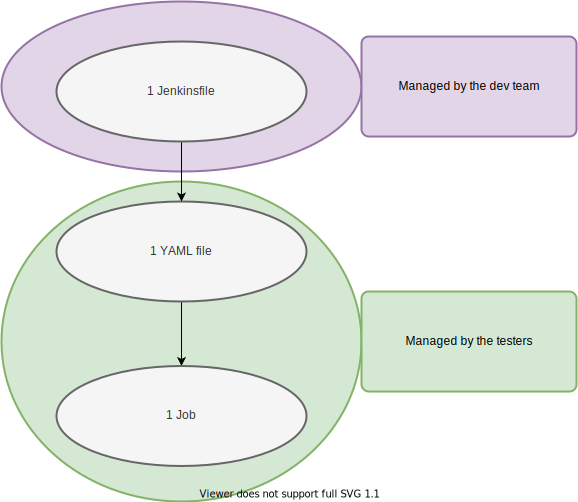

# Basic Usage

## Before installation

We require **Python 3.7 or higher version** to be installed on your system before Kalash can be installed.

Describing how to get Python working is out of the scope of our documentation.

## Installation

Simply run `pip install kalash`.

Note: for this to work `pip` needs to be in your `PATH`.

## Why use Kalash

[Why]: #why-use-kalash

Kalash was originally created as a lightweight wrapper around a `unittest.TestCase` that insulates QA Engineers from the necessity of managing automation services like Jenkins and increasing security and stability of a running automation service instance.

Simply put, we've created this because we didn't want to give admin access over Jenkins to all our QA Engineers to reduce risk of some important jobs being clobbered. 😀

Kalash has grown out to include a number of amazing features:

* built-in logger on the `TestCase` class
* runtime access to runner's configuration enabling new parametrization strategies
* ability to filter test cases against specific values outlined in the metadata tag
* ability to define complex test suites in declarative YAML or Python configuration files to modify runtime collection of tests
* ability to inspect hypothetical test suites that *would* run were the tests to be triggered

### The system

Kalash is originally intended for an automation system defined as:



What do you need to do to use it for test automation?

1. You create a YAML and name it as you want. You put that file in the `yamls` folder in a test repository. We recommend to name the YAML file after the job name. If you want a `json` create a JSON. It will work as well.
2. You contact IT so they can create an automated job for you. Or create a CI job on your own if you're not working in a team.
3. Once you have a job created any updates you make to the YAML file will affect the test collection you've specified.

## Creating a test suite

A suite is defined by a singular configuration file. The file may be:

* `.py` file - should contain exactly one `kalash.config.Trigger` instance
* `.yaml` file - should follow a specification described in [yaml specification](yaml_spec.md#yaml-config-file-specification)

Kalash will collect only test cases following a rigid template.

### Creating test cases

[Test Case Main Example]: #creating-test-cases

Each test should be based on the following test template:

```python
"""
META_START
---
id: 999999002_99-Blah_9-Whatever
META_END
"""

from kalash.run import MetaLoader, TestCase, main

import os


class TestSomething(TestCase):

    def test_1(self, name):
        print(f"Running for {name}")


if __name__ == '__main__':
    main(testLoader=MetaLoader())

```

This is the most minimal test template specifying a metadata section and a slightly modified wrapped `unittest.TestCase` class with additional features.

A more built-out example would be:

```python
"""
META_START
---
id: 999999002_99-Blah_9-Whatever              # ID of the test
use_cases:                              # JIRA ticket names of the related use cases
  - FearFactory                               # Example JIRA ticket name
workbenches:                                  # Workbench where the test is meant to be run
  - Gojira                                    # Example workbench
devices:                                      # Resources to run with
  - cancombo
  - lincombo
META_END
"""

from kalash.run import MetaLoader, TestCase, main, parameterized


class TestAdvancedFiltering1(TestCase):

    @parameterized.expand(['lincombo', 'cancombo'])
    def test_1(self, name):
        self.allow_when('run_only_with', name)
        print(f"Running for {name}")


if __name__ == '__main__':
    main(testLoader=MetaLoader())

```

### Running the tests

To trigger a particular test suite you may run `kalash run -f ./path/to/config.py` and if you need more configuration options run `kalash --help`.

### Reports

[Reports]: #reports

By default test reports will be written to the current working directory, unless overridden by the `report` key in the `config` section (see: [yaml specification](yaml_spec.md#yaml-config-file-specification)).

The reports produced by Kalash are standard XML XUnit reports that can be parsed and displayed by a treasure trove of open-source applications.

### Logging

[Logging]: #logging

Every test case has a built-in logger that gets destroyed as soon as the test is complete. You can access it via `self.logger` on the `TestCase` class. For example:

```python
"""
META_START
---
id: 999999001_99-Blah_9-Whatever
META_END
"""

from kalash.run import MetaLoader, TestCase, main


class TestLogger1(TestCase):

    def test_1(self):
        self.logger.info("hello1")


if __name__ == '__main__':
    main(testLoader=MetaLoader())

```

#### Logger configuration

The logger can be configured using the following CLI switches:

* `--log-dir` - base directory for logs
* `--log-level` - Python's `logging` library log verbosity
* `--log-format` - Python's `logging` library formatter string
* `--group-by` - grouping log files by metadata tags

By default logs are written to a `logs` folder in the current working directory. Each test case gets its separate folder and log files contained within start with a timestamp.

If `--group-by` is used, those test case folders are grouped by any specified property from the metadata tag. For example `--group-by devices` will group test cases by the `devices` key. If `devices` is a single string e.g. `"cancombo"` the log tree will be `"logs/cancombo/TestCaseID/123456789_TestCaseID"`. If `devices` is a list, e.g. `["cancombo", "lincombo"]`, the log tree will be `"logs/cancombo_lincombo/TestCaseID/123456789_TestCaseID"`.

### JSON Schema

You can make use of a JSON schema to make writing your YAML or JSON files a little easier. The schema is located [here](https://raw.githubusercontent.com/Technica-Engineering/kalash/master/kalash/spec.schema.json).

#### Example schema setup - VSCode

Every editor handles JSON schemas a little differently. Here is an example on how to configure Visual Studio Code.

1. Open Settings (Ctrl+Shift+P and type in settings) as JSON.
2. Modify or add `"yaml.schemas"` like this:

    ```json
    "yaml.schemas": {
        "https://raw.githubusercontent.com/Technica-Engineering/kalash/feature/7-8-schemas-and-json/kalash/spec.schema.json": "*.k.yaml"
    },
    ```

3. Name Kalash YAML files with `.k.yaml` extension. When you open such file, the schema will be automatically loaded and will suggest what keys are allowed in the YAML file.

If you are using JSON files instead, you could do this:

1. Open Settings (Ctrl+Shift+P and type in settings) as JSON.
2. Modify or add `"json.schemas"` like this:

    ```json
    "json.schemas": {
        "https://raw.githubusercontent.com/Technica-Engineering/kalash/feature/7-8-schemas-and-json/kalash/spec.schema.json": "*.k.json"
    },
    ```

3. Name Kalash JSON files with `.k.json` extension. When you open such file, the schema will be automatically loaded and will suggest what keys are allowed in the JSON file.
